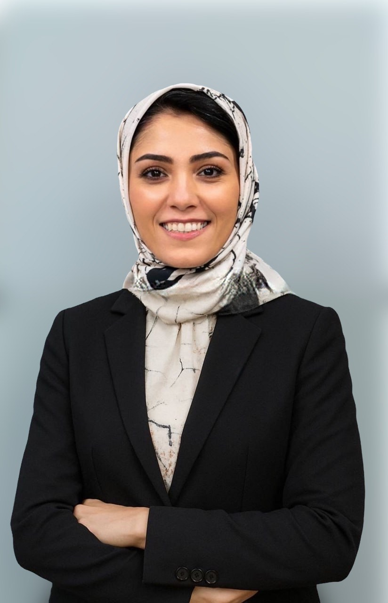

<table>
  <tr>
    <td style="width: 260px; vertical-align: top;">
      
    </td>
    <td style="padding-left: 30px;">
      <h2>Ghazaleh Soleimani</h2>
      

        I am a postdoctoral researcher at the University of Minnesota with a background in engineering and a specialization in neuroimaging and non-invasive brain stimulation, including TMS and tES techniques. During my postdoctoral training, I have worked under the mentorship of experts in both psychiatry—<a href="https://www.neuroscience.umn.edu/people/kelvin-o-lim-md">Dr. Kelvin O. Lim</a> and <a href="https://www.laureateinstitute.org/hamed-ekhtiari.html">Dr. Hamed Ekhtiari</a>—and biomedical engineering—<a href="https://cse.umn.edu/bme/alexander-opitz">Dr. Alexander Opitz</a>.
      

    </td>
  </tr>
</table>

My research focuses on developing personalized neuromodulation strategies for the treatment of substance use disorders (SUDs) by integrating structural and functional MRI, EEG, electric field modeling, and machine learning. I lead both clinical and computational projects aimed at optimizing stimulation targets and dosing based on individual brain profiles. I am particularly interested in combining neuroimaging and stimulation data to better understand the neural mechanisms underlying addiction and to improve treatment outcomes.

My long-term goal is to advance precision medicine in addiction science through translational research, interdisciplinary collaboration, and innovative methodological approaches.

