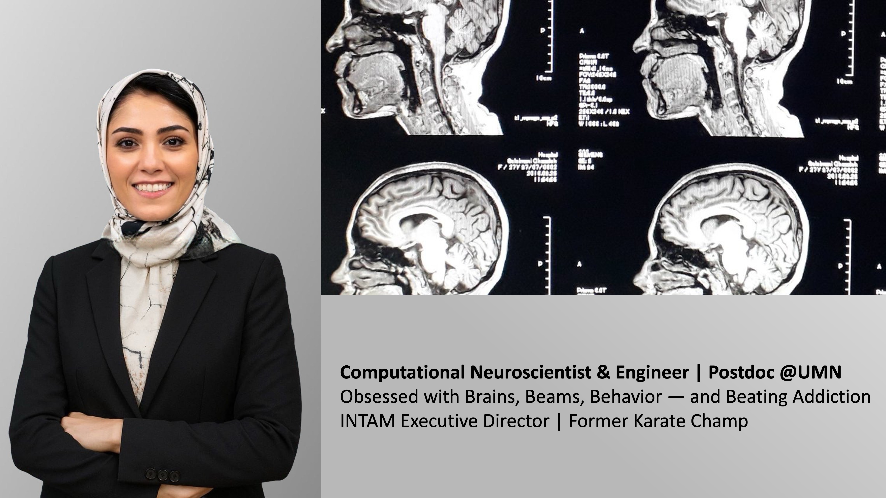

<!-- SEO Meta Tags -->
<meta name="description" content="Ghazaleh Soleimani is a postdoctoral researcher at the University of Minnesota specializing in brain stimulation, neuroimaging, and addiction neuroscience.">
<meta name="keywords" content="Ghazaleh Soleimani, University of Minnesota, TMS, tES, EEG, neuroimaging, addiction, brain stimulation, neuroscience, fMRI, computational modeling">
<meta name="author" content="Ghazaleh Soleimani">

<h2>Ghazaleh (She/her)</h2>

  (Pronounced like <a href="https://en.wikipedia.org/wiki/Gazelle" target="_blank" style="color: #555; text-decoration: underline;">Gazelle</a> — a symbol of beautiful eyes and the rising sun in Persian culture☀️🦌)

I am a postdoctoral researcher at the University of Minnesota with a background in engineering and a specialization in neuroimaging and non-invasive brain stimulation, including TMS and tES techniques. During my postdoctoral training, I have worked under the mentorship of experts in both psychiatry—
<a href="https://www.neuroscience.umn.edu/people/kelvin-o-lim-md">Dr. Kelvin O. Lim</a> and
<a href="https://www.laureateinstitute.org/hamed-ekhtiari.html">Dr. Hamed Ekhtiari</a>—and biomedical engineering—
<a href="https://cse.umn.edu/bme/alexander-opitz">Dr. Alexander Opitz</a>.

  <a href="CV_GhazalehSoleimani_ver22.pdf" target="_blank" style="display: inline-block; padding: 8px 16px; background-color: #004080; color: white; text-decoration: none; border-radius: 6px;">📄 Download My CV</a>

 

My research focuses on developing personalized neuromodulation strategies for the treatment of substance use disorders (SUDs) by integrating structural and functional MRI, EEG, electric field modeling, and machine learning. I lead both clinical and computational projects aimed at optimizing stimulation targets and dosing based on individual brain profiles. I am particularly interested in combining neuroimaging and stimulation data to better understand the neural mechanisms underlying addiction and to improve treatment outcomes.

My long-term goal is to advance precision medicine in addiction science through translational research, interdisciplinary collaboration, and innovative methodological approaches.
