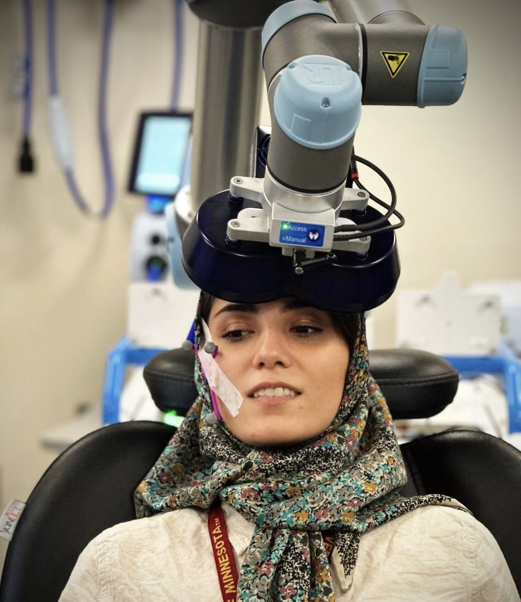
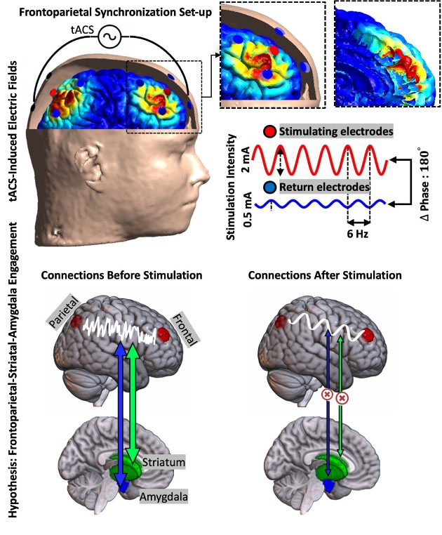
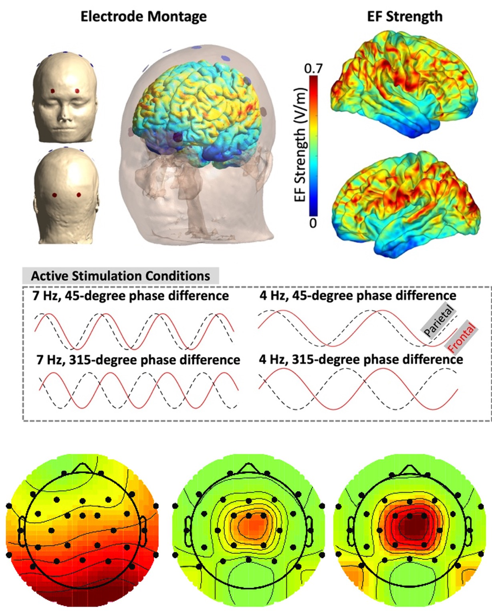

## 🧪 Featured Projects

### 🎯 Personalized Brain Stimulation in SUD

Investigating how electric field modeling and individualized neuroimaging data can guide TMS/tES interventions for substance use disorders.
 
🔗 <a href="https://example.com/personalized-nibs" target="_blank">Read More</a>

---

### 🧠 Traveling Wave tACS for Working Memory

A randomized, cross-over trial testing how theta-phase synchronized stimulation impacts EEG connectivity and behavioral performance.
 
🔗 <a href="https://example.com/tacs-working-memory" target="_blank">Read More</a>

---

### 🖥️ Closed-Loop TMS-EEG Task (MATLAB + Python)

A real-time task with TTL-triggered feedback designed to modulate and measure EEG states during neurostimulation.
 
🔗 <a href="https://github.com/SoleimaniGhazaleh/ClosedLoop_Task" target="_blank">View on GitHub</a>

